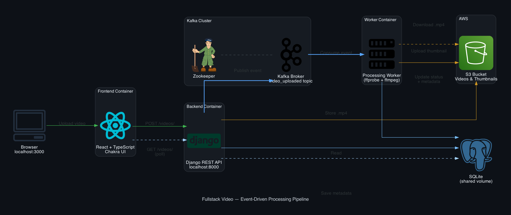
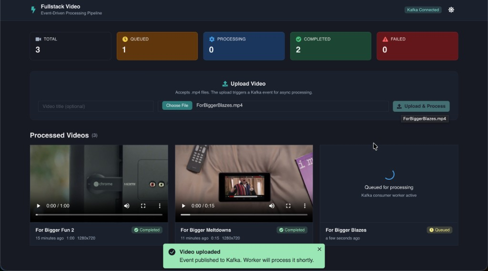
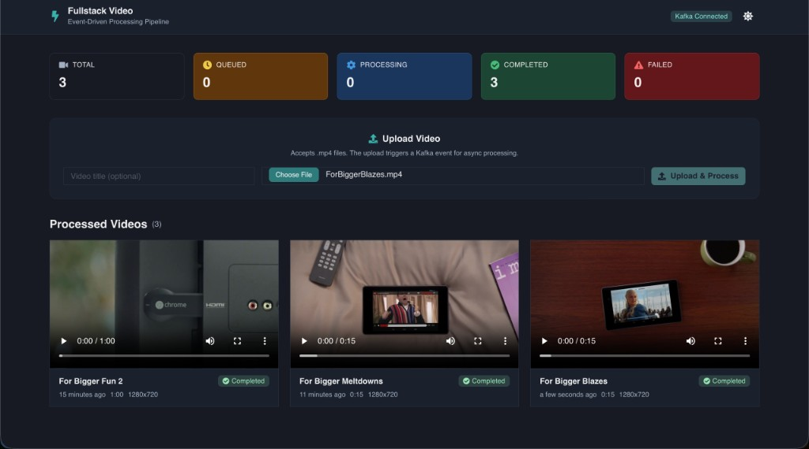

<!-- Improved compatibility of back to top link: See: https://github.com/othneildrew/Best-README-Template/pull/73 -->
<a name="readme-top"></a>
<!--
*** Thanks for checking out the Best-README-Template. If you have a suggestion
*** that would make this better, please fork the repo and create a pull request
*** or simply open an issue with the tag "enhancement".
*** Don't forget to give the project a star!
*** Thanks again! Now go create something AMAZING! :D
-->


<!-- PROJECT SHIELDS -->
<!--
*** I'm using markdown "reference style" links for readability.
*** Reference links are enclosed in brackets [ ] instead of parentheses ( ).
*** See the bottom of this document for the declaration of the reference variables
*** for contributors-url, forks-url, etc. This is an optional, concise syntax you may use.
*** https://www.markdownguide.org/basic-syntax/#reference-style-links
-->


## Architecture



[![React][React.js]][React-url]


<!-- PROJECT LOGO -->
<br />
<div align="center">

  <h3 align="center">Fullstack Video</h3>

  <p align="center">
    An event-driven video processing platform powered by Apache Kafka
    <br />
  
  </p>
</div>

### Event-Driven Processing Pipeline

When a video is uploaded, the backend publishes a `video_uploaded` event to Kafka. A background worker consumes the event, generates a thumbnail, extracts metadata (duration, resolution), and updates the database, all asynchronously.

**Video queued for processing:**



**Processing complete — thumbnail, duration, and resolution extracted:**



<!-- TABLE OF CONTENTS -->
<details>
  <summary>Table of Contents</summary>
  <ol>
    <li>
      <a href="#about-the-project">About The Project</a>
      <ul>
        <li><a href="#built-with">Built With</a></li>
      </ul>
    </li>
    <li><a href="#roadmap">Roadmap</a></li>
    <li>
      <a href="#getting-started">Getting Started</a>
    </li>
    <li><a href="#usage">Usage</a></li>
   
  </ol>
</details>


<!-- ABOUT THE PROJECT -->
## About The Project


I watch a lot of YouTube and I've always been curious about what happens behind the scenes when you upload a video. How does the thumbnail show up? How does it know the resolution and duration? Why doesn't the upload just hang while all that work happens?

So I built this to find out. The backend is Django REST Framework (I wanted to stick with what I know rather than jump to FastAPI), and the frontend is React + TypeScript with Chakra UI. Videos get stored in S3 via django-storages.

The part I'm most proud of is the Kafka integration. When you upload a video, the API stores the file and then publishes a `video_uploaded` event to Kafka; It doesn't sit there generating thumbnails or extracting metadata. A separate worker process picks up that event, downloads the video from S3, runs ffmpeg/ffprobe to generate a thumbnail and pull out duration + resolution, then writes everything back to the database. The frontend polls every few seconds so you can actually watch it go from "Queued" to "Completed."

I want to keep building on this, e.g. by adding Flink for stream processing, transcoding pipelines, Elasticsearch for search, Redis for caching popular videos. The nice thing about using Kafka is that I can just add more consumers to the same topic without changing the upload flow at all.

* **Event-driven processing** — uploads publish a `video_uploaded` event to Apache Kafka; a background worker consumes events asynchronously
* **Thumbnail generation & metadata extraction** — worker uses FFmpeg and ffprobe to generate thumbnails and extract duration/resolution
* **Django REST Framework** API with ModelViewSets and ModelSerializers
* **AWS S3** for video and thumbnail storage via django-storages
* **Docker Compose** orchestrates Zookeeper, Kafka, Django, and the worker as separate services
* **React + TypeScript** frontend with Chakra UI and real-time status polling


<p align="right">(<a href="#readme-top">back to top</a>)</p>


<!-- ROADMAP -->
## Roadmap
- [x] Transcode Video (ffmpeg) , then publish the message to Kafka
- [x] Use Kafka as a central bus for moving data
- [ ] Implement a robust social featureset such as users, users' liked and shared videos, authentication
- [ ] Use Redis to store the urls of the most popular videos, so that they get served to the users extremely quickly
- [ ] Use ElasticSearch and make a 'video search feature' 
- [ ] Add Flink for stream analytics
- [ ] Load Balancer
- [ ] Switch from SQLite to a different database, to store our metadata
- [ ] Follow openAPI specifications

<p align="right">(<a href="#readme-top">back to top</a>)</p>

<!-- GETTING STARTED -->
## Getting Started

1. Create an AWS S3 bucket and add your credentials to `fullstackvideo/.env`:
   ```
   SECRET_KEY=your-django-secret-key
   AWS_ACCESS_KEY_ID=your-key
   AWS_SECRET_ACCESS_KEY=your-secret
   AWS_STORAGE_BUCKET_NAME=your-bucket
   AWS_S3_SIGNATURE_VERSION=s3v4
   AWS_S3_REGION_NAME=us-east-1
   ```
2. Make sure Docker and Docker Compose are installed.

<!-- USAGE EXAMPLES -->
## Usage

The backend stack (Django API + Kafka + Zookeeper + worker) and frontend run as separate Compose stacks.

**Start the backend** (API, Kafka, Zookeeper, processing worker):

```bash
cd fullstackvideo
docker-compose up --build
```

**Start the frontend** (React dev server):

```bash
cd frontend
docker-compose up --build
```

Then open [http://localhost:3000](http://localhost:3000) to use the app. The API runs at [http://localhost:8000](http://localhost:8000).
<p align="right">(<a href="#readme-top">back to top</a>)</p>


---

<details>
  <summary>Architecture Diagram (old)</summary>

  
</details>

<!-- MARKDOWN LINKS & IMAGES -->
<!-- https://www.markdownguide.org/basic-syntax/#reference-style-links -->

[React.js]: https://img.shields.io/badge/React-20232A?style=for-the-badge&logo=react&logoColor=61DAFB
[React-url]: https://reactjs.org/

